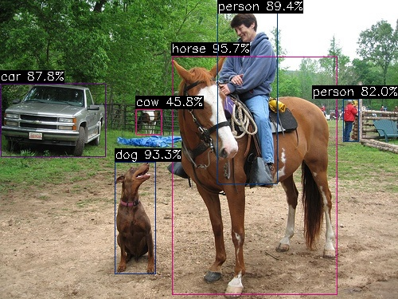

# 快速上手指南

## AXCL_SMI

AXCL-SMI (System Management Interface) 工具用于设备信息收集，对设备进行配置等功能，支持如下设备信息收集：

- 硬件设备型号
- 固件版本号
- 驱动版本号
- 设备利用率
- 内存使用情况
- 设备芯片结温
- 其他信息

### 使用说明


在正确安装AXCL驱动包后，AXCL-SMI即安装成功，直接执行`axcl-smi`显示内容如下：

```bash
# ./axcl-smi
+------------------------------------------------------------------------------------------------+
| AXCL-SMI  V2.18.0                                                              Driver  V2.18.0 |
+-----------------------------------------+--------------+---------------------------------------+
| Card  Name                     Firmware | Bus-Id       |                          Memory-Usage |
| Fan   Temp                Pwr:Usage/Cap | CPU      NPU |                             CMM-Usage |
|=========================================+==============+=======================================|
|    0  AX650N                    V2.18.0 | 0001:81:00.0 |                181 MiB /      954 MiB |
|   --   52C                      -- / -- | 3%        0% |                 22 MiB /     3072 MiB |
+-----------------------------------------+--------------+---------------------------------------+

+------------------------------------------------------------------------------------------------+
| Processes:                                                                                     |
| Card      PID  Process Name                                                   NPU Memory Usage |
|================================================================================================|
|    0      763  /opt/bin/axcl/axcl_run_model                                            160 KiB |
+------------------------------------------------------------------------------------------------+
```

**字段说明**

| 字段             | 说明                           | 字段         | 说明                 |
| ---------------- | ------------------------------ | ------------ | -------------------- |
| Card             | 设备编号，注意不是PCIe的设备号 | Bus-Id       | 设备Bus ID           |
| Name             | 设备名称                       | CPU          | CPU平均利用率        |
| Fan              | 风扇转速比（未支持）           | NPU          | NPU平均利用率        |
| Temp             | 设备芯片结温                   | Memory-Usage | 系统内存： 使用/总量 |
| Firmware         | 设备固件版本号                 | CMM-Usage    | 媒体内存： 使用/总量 |
| Pwr: Usage/Cap   | 功耗（未支持）                 |              |                      |
|                  |                                |              |                      |
| PID              | 主控进程PID                    |              |                      |
| Process Name     | 主控进程                       |              |                      |
| NPU Memory Usage | 设备NPI已使用的CMM内存         |              |                      |

#### 帮助 (-h) 和版本 (-v)

`axcl-smi -h`  查询帮助信息

```bash
# ./axcl-smi -h
usage: axcl-smi [<command> [<args>]] [--device] [--version] [--help]

axcl-smi System Management Interface V2.18.1

Commands
    info                                    Show device information
        --temp                                  Show SoC temperature
        --mem                                   Show memory usage
        --cmm                                   Show CMM usage
        --cpu                                   Show CPU usage
        --npu                                   Show NPU usage
    proc                                    cat device proc
        --vdec                                  cat /proc/ax_proc/vdec
        --venc                                  cat /proc/ax_proc/venc
        --jenc                                  cat /proc/ax_proc/jenc
        --ivps                                  cat /proc/ax_proc/ivps
        --rgn                                   cat /proc/ax_proc/rgn
        --ive                                   cat /proc/ax_proc/ive
        --pool                                  cat /proc/ax_proc/pool
        --link                                  cat /proc/ax_proc/link_table
        --cmm                                   cat /proc/ax_proc/mem_cmm_info
    set                                     Set
        -f[MHz], --freq=[MHz]                   Set CPU frequency in MHz. One of: 1200000, 1400000, 1700000
    log                                     Dump logs from device
        -t[mask], --type=[mask]                 Specifies which logs to dump by a combination (bitwise OR) value of blow:
                                                  -1: all (default) 0x01: daemon 0x02: worker 0x10: syslog 0x20: kernel
        -o[path], --output=[path]               Specifies the path to save dump logs (default: ./)
    sh                                      Execute a shell command
        cmd                                     Shell command
        args...                                 Shell command arguments
-d, --device                            Specifies a device ID or 0 (default) select all devices
-v, --version                           Show axcl-smi version
-h, --help                              Show this help menu
```

`axcl-smi -v` 查询AXCL-SMI工具的版本

```bash
# ./axcl-smi -v
axcl-smi V2.18.0 BUILD: Dec  2 2024 13:14:36
```

#### 选项

##### 设备ID (-d, --device)

```bash
-d, --device                            Specifies a device ID or 0 (default) select all devices
```

`[-d, --device]` 指定设备，默认参数 = 0，标识连接到HOST的全部设备， **-d或者--device 参数是十进制。**

:::{Note}

如何查询设备ID，参阅 [`FAQ`](#configdevice)  

:::

#### 信息查询（info）

`axcl-smi info`用于显示设备的详细信息，支持子命令如下：

| 子命令 | 说明                                                         |
| ------ | ------------------------------------------------------------ |
| --temp | 显示设备芯片结温，单位是摄氏度x1000。                        |
| --mem  | 显示设备系统详细内存使用情况。                               |
| --cmm  | 显示设备媒体内存使用情况。如果需要更详细的媒体内存，执行`axcl-smi sh cat /proc/ax_proc/mem_cmm_info -d xx`  (xx是PCIe设备号)。 |
| --cpu  | 显示设备CPU利用率。                                          |
| --npu  | 显示设备NPU利用率。                                          |

:::{Important}

结合`[-d, --device]`选项查询指定设备的信息，不指定设备则查询全部连接的设备

```bash
# 查询设备129的媒体内存使用情况
# ./axcl-smi info --cmm -d 129
Device ID           : 129 (0x81)
CMM Total           :  3145728 KiB
CMM Used            :    18876 KiB
CMM Remain          :  3126852 kiB
```

:::

#### PROC查询（proc）

`axcl-smi proc`用于查询设备模块的proc信息，支持子命令如下：

| 子命令 | 说明                                               |
| ------ | -------------------------------------------------- |
| --vdec | 查询VDEC模块proc (`cat /proc/ax_proc/vdec`)        |
| --venc | 查询VENC模块proc (`cat /proc/ax_proc/venc`)        |
| --jenc | 查询JENC模块proc (`cat /proc/ax_proc/jenc`)        |
| --ivps | 查询IVPS模块proc (`cat /proc/ax_proc/ivps`)        |
| --rgn  | 查询RGN模块proc (`cat /proc/ax_proc/rgn`)          |
| --ive  | 查询IVE模块proc (`cat /proc/ax_proc/ive`)          |
| --pool | 查询POOL模块proc (`cat /proc/ax_proc/pool`)        |
| --link | 查询LINK模块proc (`cat /proc/ax_proc/link_table`)  |
| --cmm  | 查询CMM模块proc (`cat /proc/ax_proc/mem_cmm_info`) |

:::{Note}

必须结合`[-d, --device]`选项指定设备

```bash
# ./axcl-smi proc --vdec -d 129
```

:::

#### 参数设置（set）

`axcl-smi set` 用户配置设备信息，支持的子命令如下：

| 子命令                | 说明                                                         |
| --------------------- | ------------------------------------------------------------ |
| -f[MHz], --freq=[MHz] | 设置设备的CPU频率，只支持 1200000, 1400000, 1700000 三种频率 |

:::{Note}

必须结合`[-d, --device]`选项指定设备

```bash
# ./axcl-smi set -f 1200000 -d 129
set cpu frequency 1200000 to device 129 succeed.
```

:::

#### 下载日志（log）

`axcl-smi log` 用于下载设备的日志文件到主控侧，支持的参数如下：

| 参数                      | 说明                                                         |
| ------------------------- | ------------------------------------------------------------ |
| -t[mask], --type=[mask]   | 指定下载的日志类别。设备侧日志类别如下：<br />-1： 全部日志<br />0x01：守护进程<br />0x02:  业务进程<br />0x10：syslog<br />0x20：内核日志<br />推荐-1下载全部日志 |
| -o[path], --output=[path] | 指定日志保存路径，支持绝对和相对路径，默认是当前目录。注意目录需要有写权限。 |

:::{Important}

结合`[-d, --device]`选项下载指定设备的日志，不指定设备则依次下载全部连接的设备日志。

```bash
# 下载设备号129的全部日志，并保存到当前目录
# ./axcl-smi log -d 129
[2024-12-02 15:41:00.015][934][C][log][dump][73]: log dump finished: ./dev129_log_20241202154059.tar.gz
```

:::

#### shell命令（sh）

`axcl-smi sh` 支持shell命令查询设备信息，通常用于查询设备侧模块的运行proc信息，示例：

```
# ./axcl-smi sh cat /proc/ax_proc/mem_cmm_info  -d 129
--------------------SDK VERSION-------------------
[Axera version]: ax_cmm V2.18.0_20241201230759 Dec  1 2024 23:23:40 JK
+---PARTITION: Phys(0x180000000, 0x23FFFFFFF), Size=3145728KB(3072MB),    NAME="anonymous"
 nBlock(Max=0, Cur=23, New=0, Free=0)  nbytes(Max=0B(0KB,0MB), Cur=19329024B(18876KB,18MB), New=0B(0KB,0MB), Free=0B(0KB,0MB))  Block(Max=0B(0KB,0MB), Min=0B(0KB,0MB), Avg=0B(0KB,0MB)) 
   |-Block: phys(0x180000000, 0x180013FFF), cache =non-cacheable, length=80KB(0MB),    name="TDP_DEV"
   |-Block: phys(0x180014000, 0x180014FFF), cache =non-cacheable, length=4KB(0MB),    name="TDP_CMODE3"
   |-Block: phys(0x180015000, 0x180015FFF), cache =non-cacheable, length=4KB(0MB),    name="TDP_CMODE3_CPU"
   |-Block: phys(0x180016000, 0x180029FFF), cache =non-cacheable, length=80KB(0MB),    name="TDP_DEV"
   |-Block: phys(0x18002A000, 0x18002AFFF), cache =non-cacheable, length=4KB(0MB),    name="TDP_CMODE3"
   |-Block: phys(0x18002B000, 0x18002BFFF), cache =non-cacheable, length=4KB(0MB),    name="TDP_CMODE3_CPU"
   |-Block: phys(0x18002C000, 0x180047FFF), cache =non-cacheable, length=112KB(0MB),    name="VGP_DEV"
   |-Block: phys(0x180048000, 0x180048FFF), cache =non-cacheable, length=4KB(0MB),    name="VGP_CMODE3"
   |-Block: phys(0x180049000, 0x180049FFF), cache =non-cacheable, length=4KB(0MB),    name="VGP_CMODE3_CPU"
   |-Block: phys(0x18004A000, 0x1801C9FFF), cache =non-cacheable, length=1536KB(1MB),    name="h26x_ko"
   |-Block: phys(0x1801CA000, 0x180349FFF), cache =non-cacheable, length=1536KB(1MB),    name="h26x_ko"
   |-Block: phys(0x18034A000, 0x18034AFFF), cache =non-cacheable, length=4KB(0MB),    name="h26x_ko"
   |-Block: phys(0x18034B000, 0x18094AFFF), cache =non-cacheable, length=6144KB(6MB),    name="vdec_ko"
   |-Block: phys(0x18094B000, 0x180ACAFFF), cache =non-cacheable, length=1536KB(1MB),    name="jenc_ko"
   |-Block: phys(0x180ACB000, 0x180C4AFFF), cache =non-cacheable, length=1536KB(1MB),    name="jenc_ko"
   |-Block: phys(0x180C4B000, 0x180C4BFFF), cache =non-cacheable, length=4KB(0MB),    name="jenc_ko"
   |-Block: phys(0x180C4C000, 0x180C67FFF), cache =non-cacheable, length=112KB(0MB),    name="VPP_DEV"
   |-Block: phys(0x180C68000, 0x180C68FFF), cache =non-cacheable, length=4KB(0MB),    name="VPP_CMODE3"
   |-Block: phys(0x180C69000, 0x180C69FFF), cache =non-cacheable, length=4KB(0MB),    name="VPP_CMODE3_CPU"
   |-Block: phys(0x180C6A000, 0x181269FFF), cache =non-cacheable, length=6144KB(6MB),    name="vdec_ko"
   |-Block: phys(0x18126A000, 0x18126AFFF), cache =non-cacheable, length=4KB(0MB),    name="GDC_CMDA3"
   |-Block: phys(0x18126B000, 0x18126BFFF), cache =non-cacheable, length=4KB(0MB),    name="GDC_CMDA3_CPU"
   |-Block: phys(0x18126C000, 0x18126EFFF), cache =non-cacheable, length=12KB(0MB),    name="GDC_CMD"

---CMM_USE_INFO:
 total size=3145728KB(3072MB),used=18876KB(18MB + 444KB),remain=3126852KB(3053MB + 580KB),partition_number=1,block_number=23
```

:::{Important}

- 必须结合`[-d, --device]`选项指定设备
- shell命令参数如果包含`-`,`--`,`>`等字段，可以用双引号`"-l"`将命令和参数包含在一个字符串中，比如`axcl-smi sh "ls -l" -d 129` 
- 谨慎使用shell命令对设备进行配置

:::

### FAQ

#### [查询设备ID，配置 -d, --device](#configdevice)

执行axcl-smi或者lspci，从Bus-Id字段可以获取设备ID，填入-d或--device参数。

**示例1：**

Bus-Id: 0000:03:00.0，那么设备ID = 0x03，即`-d 3`

```
[axera@localhost ~]$ lspci
00:00.0 Host bridge: Intel Corporation 8th Gen Core Processor Host Bridge/DRAM Registers (rev 07)
...
03:00.0 Multimedia video controller: Axera Semiconductor Co., Ltd Device 0650 (rev 01)
[axera@localhost ~]$ axcl-smi
+------------------------------------------------------------------------------------------------+
| AXCL-SMI  V2.18.0_20241202180518                                Driver  V2.18.0_20241202180518 |
+-----------------------------------------+--------------+---------------------------------------+
| Card  Name                     Firmware | Bus-Id       |                          Memory-Usage |
| Fan   Temp                Pwr:Usage/Cap | CPU      NPU |                             CMM-Usage |
|=========================================+==============+=======================================|
|    0  AX650N                    V2.18.0 | 0000:03:00.0 |                154 MiB /      954 MiB |
|   --   37C                      -- / -- | 1%        0% |                 18 MiB /     3072 MiB |
+-----------------------------------------+--------------+---------------------------------------+
```

**示例2：**

Bus-Id: `0001:81:00.0`，那么设备ID = 0x81 = 129，即`-d 129`

```
lspci
0000:00:00.0 Class 0604: Device 16c3:abcd (rev 01)
0001:80:00.0 Class 0604: Device 16c3:abcd (rev 01)
0001:81:00.0 Class 0400: Device 1f4b:0650 (rev 01)
/opt/bin/axcl # ./axcl-smi
i 0 = 748  pid = 748
+------------------------------------------------------------------------------------------------+
| AXCL-SMI  V2.18.0                                                              Driver  V2.18.0 |
+-----------------------------------------+--------------+---------------------------------------+
| Card  Name                     Firmware | Bus-Id       |                          Memory-Usage |
| Fan   Temp                Pwr:Usage/Cap | CPU      NPU |                             CMM-Usage |
|=========================================+==============+=======================================|
|    0  AX650N                    V2.18.0 | 0001:81:00.0 |                157 MiB /      954 MiB |
|   --   42C                      -- / -- | 2%        0% |                 18 MiB /     3072 MiB |
+-----------------------------------------+--------------+---------------------------------------+
```


## Media Sample

### axcl_sample_dmadim

1. memcpy between two device memories by AXCL_DMA_MemCopy
2. memset device memory to 0xAB by AXCL_DMA_MemCopy
3. checksum by AXCL_DMA_CheckSum
4. crop 1/4 image from (0, 0) by AXCL_DMA_MemCopyXD (AX_DMADIM_2D)

**usage**：

```bash
usage: ./axcl_sample_dmadim --image=string --width=unsigned int --height=unsigned int [options] ... 
options:
  -d, --device    device id (int [=0])
  -i, --image     nv12 image file path (string)
  -w, --width     width of nv12 image (unsigned int)
  -h, --height    height of nv12 image (unsigned int)
      --json      axcl.json path (string [=./axcl.json])
  -?, --help      print this message

-d: EP slot id, if 0, means conntect to 1st detected EP id
--json: axcl.json file path
-i: nv12 image to crop
-w: width of input nv12 image
-h: height of input nv12 image
```

**example**：
```bash
/opt/bin/axcl # ./axcl_sample_dmadim -i 1920x1080.nv12.yuv -w 1920 -h 1080
[INFO ][                            main][  30]: ============== V2.15.1_20241022175101 sample started Oct 22 2024 18:04:43 ==============
[INFO ][                            main][  46]: json: ./axcl.json
[INFO ][                            main][  61]: device id: 129
[INFO ][                        dma_copy][ 115]: dma copy device memory succeed, from 0x1c126f000 to 0x1c166f000
[INFO ][                      dma_memset][ 135]: dma memset device memory succeed, 0x1c126f000 to 0xab
[INFO ][                    dma_checksum][ 162]: dma checksum succeed, checksum = 0xaaa00000
[INFO ][                      dma_copy2d][ 277]: [0] dma memcpy 2D succeed
[INFO ][                      dma_copy2d][ 277]: [1] dma memcpy 2D succeed
[INFO ][                      dma_copy2d][ 304]: /opt/data/dma2d_output_image_960x540.nv12 is saved
[INFO ][                      dma_copy2d][ 324]: dma copy2d nv12 image pass
[INFO ][                            main][  78]: ============== V2.15.1_20241022175101 sample exited Oct 22 2024 18:04:43 ==============
```

### axcl_sample_vdec

1. Load .mp4 or .h264/h265 stream file
2. Demux nalu by ffmpeg
3. Send nalu to VDEC by frame
4. Get decodec YUV


**usage**：

```bash
usage: ./axcl_sample_vdec --url=string [options] ... 
options:
  -i, --url       mp4|.264|.265 file path (string)
  -d, --device    device id (int [=0])
      --count     grp count (int [=1])
      --json      axcl.json path (string [=./axcl.json])
  -w, --width     frame width (int [=1920])
  -h, --height    frame height (int [=1080])
      --VdChn     channel id (int [=0])
      --yuv       transfer nv12 from device (int [=0])
  -?, --help      print this message

-d: EP slot id, if 0, means conntect to 1st detected EP id
--json: axcl.json file path
-i: mp4|.264|.265 file path
--count: how many streams are decoded at same time
-w: width of decoded output nv12 image
-h: height of decoded output nv12 image
--VdChn: VDEC output channel index
      0: PP0, same width and height for input stream, cannot support scaler down.
    1: PP1, support scale down. range: [48x48, 4096x4096]
    2: PP2, support scale down. range: [48x48, 1920x1080]
```

**example**：

decode 4 streams:

```bash
/opt/bin/axcl # ./axcl_sample_vdec -i bangkok_30952_1920x1080_30fps_gop60_4Mbps.
mp4  --count 4
[INFO ][                            main][  43]: ============== V2.16.0_20241108173111 sample started Nov  8 2024 17:45:03 ==============

[INFO ][                            main][  67]: json: ./axcl.json
[INFO ][                            main][  82]: device id: 129
[INFO ][                            main][  86]: active device 129
[INFO ][             ffmpeg_init_demuxer][ 415]: [0] url: bangkok_30952_1920x1080_30fps_gop60_4Mbps.mp4
[INFO ][             ffmpeg_init_demuxer][ 478]: [0] url bangkok_30952_1920x1080_30fps_gop60_4Mbps.mp4: codec 96, 1920x1080, fps 30
[INFO ][             ffmpeg_init_demuxer][ 415]: [1] url: bangkok_30952_1920x1080_30fps_gop60_4Mbps.mp4
[INFO ][             ffmpeg_init_demuxer][ 478]: [1] url bangkok_30952_1920x1080_30fps_gop60_4Mbps.mp4: codec 96, 1920x1080, fps 30
[INFO ][             ffmpeg_init_demuxer][ 415]: [2] url: bangkok_30952_1920x1080_30fps_gop60_4Mbps.mp4
[INFO ][             ffmpeg_init_demuxer][ 478]: [2] url bangkok_30952_1920x1080_30fps_gop60_4Mbps.mp4: codec 96, 1920x1080, fps 30
[INFO ][             ffmpeg_init_demuxer][ 415]: [3] url: bangkok_30952_1920x1080_30fps_gop60_4Mbps.mp4
[INFO ][             ffmpeg_init_demuxer][ 478]: [3] url bangkok_30952_1920x1080_30fps_gop60_4Mbps.mp4: codec 96, 1920x1080, fps 30
[INFO ][                            main][ 112]: init sys
[INFO ][                            main][ 121]: init vdec
[INFO ][                            main][ 135]: start decoder 0
[INFO ][sample_get_vdec_attr_from_stream_info][ 244]: stream info: 1920x1080 payload 96 fps 30
[INFO ][ sample_get_decoded_image_thread][ 303]: [decoder  0] decode thread +++
[INFO ][                            main][ 172]: start demuxer 0
[INFO ][          ffmpeg_dispatch_thread][ 180]: [0] +++
[INFO ][             ffmpeg_demux_thread][ 280]: [0] +++
[INFO ][                            main][ 135]: start decoder 1
[INFO ][sample_get_vdec_attr_from_stream_info][ 244]: stream info: 1920x1080 payload 96 fps 30
[INFO ][ sample_get_decoded_image_thread][ 303]: [decoder  1] decode thread +++
[INFO ][                            main][ 172]: start demuxer 1
[INFO ][          ffmpeg_dispatch_thread][ 180]: [1] +++
[INFO ][             ffmpeg_demux_thread][ 280]: [1] +++
[INFO ][                            main][ 135]: start decoder 2
[INFO ][sample_get_vdec_attr_from_stream_info][ 244]: stream info: 1920x1080 payload 96 fps 30
[INFO ][                            main][ 172]: start demuxer 2
[INFO ][ sample_get_decoded_image_thread][ 303]: [decoder  2] decode thread +++
[INFO ][          ffmpeg_dispatch_thread][ 180]: [2] +++
[INFO ][             ffmpeg_demux_thread][ 280]: [2] +++
[INFO ][                            main][ 135]: start decoder 3
[INFO ][sample_get_vdec_attr_from_stream_info][ 244]: stream info: 1920x1080 payload 96 fps 30
[INFO ][ sample_get_decoded_image_thread][ 303]: [decoder  3] decode thread +++
[INFO ][                            main][ 172]: start demuxer 3
[INFO ][          ffmpeg_dispatch_thread][ 180]: [3] +++
[INFO ][             ffmpeg_demux_thread][ 280]: [3] +++
[INFO ][             ffmpeg_demux_thread][ 316]: [0] reach eof
[INFO ][             ffmpeg_demux_thread][ 411]: [0] demuxed    total 470 frames ---
[INFO ][             ffmpeg_demux_thread][ 316]: [1] reach eof
[INFO ][             ffmpeg_demux_thread][ 411]: [1] demuxed    total 470 frames ---
[INFO ][             ffmpeg_demux_thread][ 316]: [2] reach eof
[INFO ][             ffmpeg_demux_thread][ 411]: [2] demuxed    total 470 frames ---
[INFO ][             ffmpeg_demux_thread][ 316]: [3] reach eof
[INFO ][             ffmpeg_demux_thread][ 411]: [3] demuxed    total 470 frames ---
[INFO ][          ffmpeg_dispatch_thread][ 257]: [0] dispatched total 470 frames ---
[INFO ][          ffmpeg_dispatch_thread][ 257]: [1] dispatched total 470 frames ---
[INFO ][          ffmpeg_dispatch_thread][ 257]: [2] dispatched total 470 frames ---
[INFO ][          ffmpeg_dispatch_thread][ 257]: [3] dispatched total 470 frames ---
[WARN ][ sample_get_decoded_image_thread][ 349]: [decoder  0] flow end
[WARN ][ sample_get_decoded_image_thread][ 349]: [decoder  2] flow end
[INFO ][ sample_get_decoded_image_thread][ 384]: [decoder  2] total decode 470 frames
[INFO ][ sample_get_decoded_image_thread][ 384]: [decoder  0] total decode 470 frames
[INFO ][                            main][ 193]: stop decoder 0
[WARN ][ sample_get_decoded_image_thread][ 349]: [decoder  1] flow end
[INFO ][ sample_get_decoded_image_thread][ 384]: [decoder  1] total decode 470 frames
[INFO ][ sample_get_decoded_image_thread][ 390]: [decoder  2] dfecode thread ---
[INFO ][ sample_get_decoded_image_thread][ 390]: [decoder  0] dfecode thread ---
[INFO ][ sample_get_decoded_image_thread][ 390]: [decoder  1] dfecode thread ---
[INFO ][                            main][ 198]: decoder 0 is eof
[INFO ][                            main][ 193]: stop decoder 1
[WARN ][ sample_get_decoded_image_thread][ 349]: [decoder  3] flow end
[INFO ][ sample_get_decoded_image_thread][ 384]: [decoder  3] total decode 470 frames
[INFO ][ sample_get_decoded_image_thread][ 390]: [decoder  3] dfecode thread ---
[INFO ][                            main][ 198]: decoder 1 is eof
[INFO ][                            main][ 193]: stop decoder 2
[INFO ][                            main][ 198]: decoder 2 is eof
[INFO ][                            main][ 193]: stop decoder 3
[INFO ][                            main][ 198]: decoder 3 is eof
[INFO ][                            main][ 213]: stop demuxer 0
[INFO ][                            main][ 213]: stop demuxer 1
[INFO ][                            main][ 213]: stop demuxer 2
[INFO ][                            main][ 213]: stop demuxer 3
[INFO ][                            main][ 227]: deinit vdec
[INFO ][                            main][ 231]: deinit sys
[INFO ][                            main][ 235]: axcl deinit
[INFO ][                            main][ 239]: ============== V2.16.0_20241108173111 sample exited Nov  8 2024 17:45:03 ==============
```

### transcode sample (PPL: VDEC - IVPS - VENC)

1. Load .mp4 or .h264/h265 stream file
2. Demux nalu by ffmpeg
3. Send nalu frame to VDEC
4. VDEC send decoded nv12 to IVPS (if resize)
5. IVPS send nv12 to VENC
6. Send encoded nalu frame by VENC to host.


**modules deployment**：

```bash
|-----------------------------|
|          sample             |
|-----------------------------|
|      libaxcl_ppl.so         |
|-----------------------------|
|      libaxcl_lite.so        |
|-----------------------------|
|         axcl sdk            |
|-----------------------------|
|         pcie driver         |
|-----------------------------|
```

**transcode ppl attributes**：

```bash
        attribute name                       R/W    attribute value type
 *  axcl.ppl.transcode.vdec.grp             [R  ]       int32_t                            allocated by ax_vdec.ko
 *  axcl.ppl.transcode.ivps.grp             [R  ]       int32_t                            allocated by ax_ivps.ko
 *  axcl.ppl.transcode.venc.chn             [R  ]       int32_t                            allocated by ax_venc.ko
 *
 *  the following attributes take effect BEFORE the axcl_ppl_create function is called:
 *  axcl.ppl.transcode.vdec.blk.cnt         [R/W]       uint32_t          8                depend on stream DPB size and decode mode
 *  axcl.ppl.transcode.vdec.out.depth       [R/W]       uint32_t          4                out fifo depth
 *  axcl.ppl.transcode.ivps.in.depth        [R/W]       uint32_t          4                in fifo depth
 *  axcl.ppl.transcode.ivps.out.depth       [R  ]       uint32_t          0                out fifo depth
 *  axcl.ppl.transcode.ivps.blk.cnt         [R/W]       uint32_t          4
 *  axcl.ppl.transcode.ivps.engine          [R/W]       uint32_t   AX_IVPS_ENGINE_VPP      AX_IVPS_ENGINE_VPP|AX_IVPS_ENGINE_VGP|AX_IVPS_ENGINE_TDP
 *  axcl.ppl.transcode.venc.in.depth        [R/W]       uint32_t          4                in fifo depth
 *  axcl.ppl.transcode.venc.out.depth       [R/W]       uint32_t          4                out fifo depth

NOTE:
 The value of "axcl.ppl.transcode.vdec.blk.cnt" depends on input stream.
 Usually set to dpb + 1
```

**usage**：

```bash
usage: ./axcl_sample_transcode --url=string --device=int [options] ... 
options:
  -i, --url       mp4|.264|.265 file path (string)
  -d, --device    device id (int)
      --json      axcl.json path (string [=./axcl.json])
      --loop      1: loop demux for local file  0: no loop(default) (int [=0])
      --dump      dump file path (string [=])
  -?, --help      print this message

-d: EP slot id
--json: axcl.json file path
-i: mp4|.264|.265 file path
--loop: loop to transcode local file until CTRL+C to quit
--dump: dump encoded nalu to local file
```

>
> ./axcl_sample_transcode: error while loading shared libraries: libavcodec.so.58: cannot open shared object file: No such file or directory
> if above error happens, please configure ffmpeg libraries into LD_LIBRARY_PATH.
> As for x86_x64 OS:  *export LD_LIBRARY_PATH=$LD_LIBRARY_PATH:/usr/lib/axcl/ffmpeg*
>

**example**：

```bash
# transcode input 1080P@30fps 264 to 1080P@30fps 265, save into /tmp/axcl/transcode.dump.pidxxx file.
./axcl_sample_transcode -i bangkok_30952_1920x1080_30fps_gop60_4Mbps.mp4  -d 129 --dump /tmp/axcl/transcode.265
[INFO ][                            main][  65]: ============== V2.16.0 sample started Nov  7 2024 16:40:05 pid 1623 ==============

[WARN ][                            main][  85]: if enable dump, disable loop automatically
[INFO ][             ffmpeg_init_demuxer][ 415]: [1623] url: bangkok_30952_1920x1080_30fps_gop60_4Mbps.mp4
[INFO ][             ffmpeg_init_demuxer][ 478]: [1623] url bangkok_30952_1920x1080_30fps_gop60_4Mbps.mp4: codec 96, 1920x1080, fps 30
[INFO ][         ffmpeg_set_demuxer_attr][ 547]: [1623] set ffmpeg.demux.file.frc to 1
[INFO ][         ffmpeg_set_demuxer_attr][ 550]: [1623] set ffmpeg.demux.file.loop to 0
[INFO ][                            main][ 173]: pid 1623: [vdec 00] - [ivps -1] - [venc 00]
[INFO ][                            main][ 191]: pid 1623: VDEC attr ==> blk cnt: 8, fifo depth: out 4
[INFO ][                            main][ 192]: pid 1623: IVPS attr ==> blk cnt: 4, fifo depth: in 4, out 0, engine 3
[INFO ][                            main][ 194]: pid 1623: VENC attr ==> fifo depth: in 4, out 4
[INFO ][          ffmpeg_dispatch_thread][ 180]: [1623] +++
[INFO ][             ffmpeg_demux_thread][ 280]: [1623] +++
[INFO ][             ffmpeg_demux_thread][ 316]: [1623] reach eof
[INFO ][             ffmpeg_demux_thread][ 411]: [1623] demuxed    total 470 frames ---
[INFO ][          ffmpeg_dispatch_thread][ 257]: [1623] dispatched total 470 frames ---
[INFO ][                            main][ 223]: ffmpeg (pid 1623) demux eof
[2024-11-07 16:51:16.541][1633][W][axclite-venc-dispatch][dispatch_thread][44]: no stream in veChn 0 fifo
[INFO ][                            main][ 240]: total transcoded frames: 470
[INFO ][                            main][ 241]: ============== V2.16.0 sample exited Nov  7 2024 16:40:05 pid 1623 ==============
```

**launch_transcode.sh**：

**launch_transcode.sh** supports to launch multi.(max. 16) axcl_sample_transcode and configure LD_LIBRARY_PATH automatically.

```bash
Usage:
./launch_transcode.sh 16 -i bangkok_30952_1920x1080_30fps_gop60_4Mbps.mp4  -d 3 --dump /tmp/axcl/transcode.265
```

>
> The 1st argument must be the number of *axcl_sample_transcode* processes. range: [1, 16]
>


## NPU Sample

### NPU测试工具

#### axcl_run_model

`AXCL` 安装完毕后，模型跑分的工具 `axcl_run_model` 就可以使用了。该工具参数较多，可以用 `axcl_run_model --help` 查看可用的参数；如果对其实现机制感兴趣，还可以检查对应的 `sample` 目录中的源码。该工具和其他 `cv & llm sample` 一起，是源码形式提供的，以便于用户理解 `API` 的用法。

以测试一个模型的运行速度为例，使用 `axcl_run_model -m your_model.axmodel -r 100` 这样的形式 `-m` 指定要跑的模型，`-r` 指定重复次数，即可简单的跑测模型的速度。

```bash
/root # axcl_run_model -m yolov5s.axmodel -r 100
   Run AxModel:
         model: /opt/data/npu/models/yolov5s.axmodel
          type: 1 Core
          vnpu: Disable
        warmup: 1
        repeat: 100
         batch: { auto: 1 }
    axclrt ver: 1.0.0
   pulsar2 ver: 1.2-patch2 7e6b2b5f
      tool ver: 0.0.1
      cmm size: 12730188 Bytes
  ---------------------------------------------------------------------------
  min =   7.793 ms   max =   7.929 ms   avg =   7.804 ms  median =   7.799 ms
   5% =   7.796 ms   90% =   7.808 ms   95% =   7.832 ms     99% =   7.929 ms
  ---------------------------------------------------------------------------

```

#### axcl_sample_runtime

1. Initialize axcl runtime by axclrtInit.
2. Active EP by axclrtSetDevice.
3. Create context by axclrtCreateDevice for main thread. (optional)
4. Create and destory thread context. (must)
5. Destory context of main thread.
6. Deactive EP by axclrtResetDevice
7. Deinitialize runtime by axclFinalize

**usage**：

```bash
usage: ./axcl_sample_runtime [options] ... 
options:
  -d, --device    device id (int [=0])
      --json      axcl.json path (string [=./axcl.json])
  -?, --help      print this message

-d: EP slot id, if 0, means conntect to 1st detected EP id
--json: axcl.json file path
```

**example**：

```bash
/opt/bin/axcl # ./axcl_sample_runtime 
[INFO ][                            main][  22]: ============== V2.15.1_20241022175101 sample started Oct 22 2024 18:04:34 ==============
[INFO ][                            main][  34]: json: ./axcl.json
[INFO ][                            main][  48]: device id: 129
[INFO ][                            main][  78]: ============== V2.15.1_20241022175101 sample exited Oct 22 2024 18:04:34 ==============
```

#### axcl_sample_memory

sample for memcpy between host and device

        HOST                      DEVICE
    host_mem[0] ---------------> dev_mem[0] ----
                                               |
                                               |
    host_mem[1] <--------------- dev_mem[1] <---

1. alloc 2 host memories: *host_mem[2]*
2. alloc 2 device memories: *dev_mem[2]*
3. memcpy from host_mem[0] to dev_mem[0] by AXCL_MEMCPY_HOST_TO_DEVICE
4. memcpy from dev_mem[0] to dev_mem[1] by AXCL_MEMCPY_DEVICE_TO_DEVICE
5. memcpy from dev_mem[1] to host_mem[0] by AXCL_MEMCPY_DEVICE_TO_HOST
6. memcmp between host_mem[0] and host_mem[1]


**usage**：

```bash
usage: ./axcl_sample_memory [options] ... 
options:
  -d, --device    device id (int [=0])
      --json      axcl.json path (string [=./axcl.json])
  -?, --help      print this message

-d: EP slot id, if 0, means conntect to 1st detected EP id
--json: axcl.json file path
```

**example**：

```bash
/opt/bin/axcl # ./axcl_sample_memory
[INFO ][                            main][  32]: ============== V2.15.1_20241022175101 sample started Oct 22 2024 18:04:36 ==============
[INFO ][                           setup][ 112]: json: ./axcl.json
[INFO ][                           setup][ 127]: device id: 129
[INFO ][                            main][  51]: alloc host and device memory, size: 0x800000
[INFO ][                            main][  63]: memory [0]: host 0xffff963fd010, device 0x1c126f000
[INFO ][                            main][  63]: memory [1]: host 0xffff95bfc010, device 0x1c1a6f000
[INFO ][                            main][  69]: memcpy from host memory[0] 0xffff963fd010 to device memory[0] 0x1c126f000
[INFO ][                            main][  75]: memcpy device memory[0] 0x1c126f000 to device memory[1] 0x1c1a6f000
[INFO ][                            main][  81]: memcpy device memory[1] 0x1c1a6f000 to host memory[0] 0xffff95bfc010
[INFO ][                            main][  88]: compare host memory[0] 0xffff963fd010 and host memory[1] 0xffff95bfc010 success
[INFO ][                         cleanup][ 142]: deactive device 129 and cleanup axcl
[INFO ][                            main][ 106]: ============== V2.15.1_20241022175101 sample exited Oct 22 2024 18:04:36 ==============
```


### 视觉模型


AXCL-Samples 由 爱芯元智 主导开发。该项目实现了常见的深度学习开源算法在基于 爱芯元智 的 SoC 实现的 PCIE算力卡 产品上的运行的示例代码，方便社区开发者进行快速评估和适配。

- [axcl-samples](https://github.com/AXERA-TECH/axcl-samples)；
- 该仓库采用最简单的方式展示常用的开源模型，例如 Ultralytics 的 YOLO 系列，DepthAnything，YOLO-Worldv2 等等。

获取示例

- AXCL-Samples 的预编译 ModelZoo 请参考
  - [百度网盘](https://pan.baidu.com/s/1cnMeqsD-hErlRZlBDDvuoA?pwd=oey4)

#### YOLO11x

基于 Ultralytics YOLO11 系列模型详细的模型导出、量化、编译的流程请参考[《基于 AX650N 部署 YOLO11》](https://zhuanlan.zhihu.com/p/772269394)

```
(base) axera@raspberrypi:~/temp $ ./axcl_yolo11 -i ssd_horse.jpg -m yolo11x.axmodel
--------------------------------------
model file : yolo11x.axmodel
image file : ssd_horse.jpg
img_h, img_w : 640 640
--------------------------------------
post process cost time:1.44 ms
--------------------------------------
Repeat 1 times, avg time 24.69 ms, max_time 24.69 ms, min_time 24.69 ms
--------------------------------------
detection num: 6
17:  96%, [ 216,   71,  423,  370], horse
16:  93%, [ 144,  203,  196,  345], dog
 0:  89%, [ 273,   14,  349,  231], person
 2:  88%, [   1,  105,  132,  197], car
 0:  82%, [ 431,  124,  451,  178], person
19:  46%, [ 171,  137,  202,  169], cow
--------------------------------------
```


#### YOLO11x-Seg

```
(base) axera@raspberrypi:~/temp $ ./axcl_yolo11_seg -i ssd_horse.jpg -m yolo11x-seg.axmodel
--------------------------------------
model file : yolo11x-seg.axmodel
image file : ssd_horse.jpg
img_h, img_w : 640 640
--------------------------------------
post process cost time:3.12 ms
--------------------------------------
Repeat 1 times, avg time 34.75 ms, max_time 34.75 ms, min_time 34.75 ms
--------------------------------------
detection num: 6
17:  96%, [ 216,   71,  423,  370], horse
16:  93%, [ 144,  203,  196,  345], dog
 0:  89%, [ 273,   14,  349,  231], person
 2:  88%, [   1,  105,  132,  197], car
 0:  82%, [ 431,  124,  451,  178], person
19:  46%, [ 171,  137,  202,  169], cow
--------------------------------------
```


#### YOLO11x-Pose

```
axera@raspberrypi:~/temp $ ./axcl_yolo11_pose -i football.jpg -m yolo11x-pose.axmodel
--------------------------------------
model file : yolo11x-pose.axmodel
image file : football.jpg
img_h, img_w : 640 640
--------------------------------------
post process cost time:0.59 ms
--------------------------------------
Repeat 1 times, avg time 25.02 ms, max_time 25.02 ms, min_time 25.02 ms
--------------------------------------
detection num: 6
 0:  94%, [1350,  337, 1632, 1036], person
 0:  93%, [ 492,  477,  658, 1000], person
 0:  92%, [ 756,  219, 1126, 1154], person
 0:  91%, [   0,  354,  314, 1108], person
 0:  73%, [   0,  530,   81, 1017], person
 0:  54%, [ 142,  589,  239, 1013], person
--------------------------------------
```


#### YOLO World v2

YOLO-Worldv2 该模型的详细模型导出、量化、编译的流程请参考[《再谈 YOLO World 部署》](https://zhuanlan.zhihu.com/p/721856217)

- 模型：yoloworldv2_4cls_50_npu3.axmodel
- 输入图片：ssd_horse.jpg
- 输入文本：dog.bin, 对应的 4 分类 'dog' 'horse' 'sheep' 'cow'

```
axera@raspberrypi:~/temp $ ./axcl_yolo_world_open_vocabulary -m yoloworldv2_4cls_50_npu3.axmodel -t dog.bin -i ssd_horse.jpg
--------------------------------------
model file : yoloworldv2_4cls_50_npu3.axmodel
image file : ssd_horse.jpg
text_feature file : dog.bin
img_h, img_w : 640 640
--------------------------------------
post process cost time:0.35 ms
--------------------------------------
Repeat 1 times, avg time 4.47 ms, max_time 4.47 ms, min_time 4.47 ms
--------------------------------------
detection num: 2
 1:  91%, [ 215,   71,  421,  374], class2
 0:  67%, [ 144,  204,  197,  346], class1
--------------------------------------
```


#### YOLOv7-Face

```
axera@raspberrypi:~/temp $ ./axcl_yolov7_face -m yolov7-face.axmodel -i selfie.jpg
--------------------------------------
model file : yolov7-face.axmodel
image file : selfie.jpg
img_h, img_w : 640 640
--------------------------------------
post process cost time:8.28 ms
--------------------------------------
Repeat 1 times, avg time 12.17 ms, max_time 12.17 ms, min_time 12.17 ms
--------------------------------------
detection num: 277
 0:  91%, [1137,  869, 1283, 1065], face
 0:  91%, [1424,  753, 1570,  949], face
......
 0:  20%, [1120,  570, 1145,  604], face
 0:  20%, [1025,  390, 1041,  413], face
```


#### DepthAnything

DepthAnything 该模型的详细模型导出、量化、编译的流程请参考[《基于 AX650N 的 Depth Anything》](https://zhuanlan.zhihu.com/p/681378259)

```
axera@raspberrypi:~/temp/axcl-samples/build $ ./install/bin/ax_depth_anything -m depth_anything.axmodel -i ssd_horse.jpg
--------------------------------------
model file : depth_anything.axmodel
image file : ssd_horse.jpg
img_h, img_w : 384 640
--------------------------------------
post process cost time:4.43 ms
--------------------------------------
Repeat 1 times, avg time 44.02 ms, max_time 44.02 ms, min_time 44.02 ms
--------------------------------------
```


### LLM 示例

- 模型转请参考[大模型编译文档](https://pulsar2-docs.readthedocs.io/zh-cn/latest/appendix/build_llm.html)
- 预编译 ModelZoo-LLM 请参考[百度网盘](https://pan.baidu.com/s/1grJNjcpUln-fDBisJxuvCA?pwd=mys8)

#### Tokenizer 解析器

**tokenizer 解析准备**

为了更方便、更准确的进行 LLM DEMO 展示，我们采用 transformers 内置的 tokenizer 解析服务，因此需要安装 python 环境和 transformers 库

安装 miniconda

```
wget https://repo.anaconda.com/miniconda/Miniconda3-latest-Linux-aarch64.sh
chmod a+x Miniconda3-latest-Linux-aarch64.sh
./Miniconda3-latest-Linux-aarch64.sh
```

启用 python 环境

```
conda create --name axcl python=3.9
conda activate axcl
```

安装 transformers

```
pip install transformers==4.41.1 -i https://mirrors.aliyun.com/pypi/simple
```

#### Qwen2.5

拷贝相关文件到 Host

**文件说明**

```
(base) axera@raspberrypi:~/qwen2.5-0.5b-prefill-ax650 $ tree
.
├── main_pcie_prefill
├── qwen2.5-0.5B-prefill-ax650
│   ├── model.embed_tokens.weight.bfloat16.bin
│   ├── qwen2_p128_l0_together.axmodel
│   ├── qwen2_p128_l10_together.axmodel
......
│   ├── qwen2_p128_l8_together.axmodel
│   ├── qwen2_p128_l9_together.axmodel
│   └── qwen2_post.axmodel
├── qwen2.5_tokenizer
│   ├── merges.txt
│   ├── tokenizer_config.json
│   ├── tokenizer.json
│   └── vocab.json
├── qwen2.5_tokenizer.py
└── run_qwen2.5_0.5B_prefill_pcie.sh
```

**启动 tokenizer 解析器**

运行 tokenizer 服务，Host ip 默认为 localhost，端口号设置为 12345，正在运行后信息如下

```
(axcl) axera@raspberrypi:~/qwen2.5-0.5b-prefill-ax650 $ python qwen2.5_tokenizer.py --port 12345
None of PyTorch, TensorFlow >= 2.0, or Flax have been found. Models won't be available and only tokenizers, configuration and file/data utilities can be used.
Special tokens have been added in the vocabulary, make sure the associated word embeddings are fine-tuned or trained.
None None 151645 <|im_end|>
<|im_start|>system
You are Qwen, created by Alibaba Cloud. You are a helpful assistant.<|im_end|>
<|im_start|>user
hello world<|im_end|>
<|im_start|>assistant

[151644, 8948, 198, 2610, 525, 1207, 16948, 11, 3465, 553, 54364, 14817, 13, 1446, 525, 264, 10950, 17847, 13, 151645, 198, 151644, 872, 198, 14990, 1879, 151645, 198, 151644, 77091, 198]
http://localhost:12345
```

**运行 Qwen 2.5**

```
(base) axera@raspberrypi:~/qtang/llama_axera_cpp $ ./run_qwen2_0.5B_prefill_pcie.sh
[I][                            Init][ 129]: LLM init start
  7% | ███                               |   2 /  27 [1.30s<17.54s, 1.54 count/s] embed_selector init okcat: /proc/ax_proc/mem_cmm_info: No such file or directory
 11% | ████                              |   3 /  27 [1.75s<15.74s, 1.72 count/s] init 0 axmodel ok,remain_cmm(-1 MB)cat: /proc/ax_proc/mem_cmm_info: No such file or directory
......
 96% | ███████████████████████████████   |  26 /  27 [7.34s<7.62s, 3.54 count/s] init 23 axmodel ok,remain_cmm(-1 MB)cat: /proc/ax_proc/mem_cmm_info: No such file or directory
100% | ████████████████████████████████ |  27 /  27 [12.84s<12.84s, 2.10 count/s] init post axmodel ok,remain_cmm(-1 MB)
[I][                            Init][ 253]: max_token_len : 1023
[I][                            Init][ 258]: kv_cache_size : 128, kv_cache_num: 1023
[I][                            Init][ 266]: prefill_token_num : 128
[I][                            Init][ 348]: LLM init ok
Type "q" to exit, Ctrl+c to stop current running
>> 你是谁？
[I][                             Run][ 511]: ttft: 128.70 ms
我是来自阿里云的大规模语言模型，我叫通义千问。
[N][                             Run][ 636]: hit eos,avg 26.44 token/s

>> 深圳在哪里？
[I][                             Run][ 511]: ttft: 128.96 ms
深圳位于中国广东省，是中国的经济中心之一。
[N][                             Run][ 636]: hit eos,avg 25.89 token/s

>> q

```

#### InternVL2-1B

InternVL2-1B 的详细模型导出、量化、编译的流程请参考[《基于 AX650N/AX630C 部署多模态大模型 InternVL2-1B》](https://zhuanlan.zhihu.com/p/4118849355)

拷贝相关文件到 Host 

**文件说明**

```
(axcl) axera@raspberrypi:~/internvl2-1b-448-ax650 $ tree
.
├── internvl2_tokenizer
│   ├── added_tokens.json
│   ├── merges.txt
│   ├── special_tokens_map.json
│   ├── tokenizer_config.json
│   └── vocab.json
├── internvl2_tokenizer_448.py
├── internvl_448
│   ├── intervl_vision_part_448.axmodel
│   ├── model.embed_tokens.weight.bfloat16.bin
│   ├── qwen2_p320_l0_together.axmodel
......
│   ├── qwen2_p320_l9_together.axmodel
│   └── qwen2_post.axmodel
├── main_internvl
├── main_internvl_pcie
├── run_internvl2_448_ax650.sh
└── run_internvl2_448_pcie.sh
```

**启动 tokenizer 解析器**

运行 tokenizer 服务，Host ip 默认为 localhost，端口号设置为 12345，正在运行后信息如下

```
(axcl_test) axera@raspberrypi:~/internvl2-1b-448-ax650 $ python internvl2_tokenizer_448.py --port 12345
None of PyTorch, TensorFlow >= 2.0, or Flax have been found. Models won't be available and only tokenizers, configuration and file/data utilities can be used.
Special tokens have been added in the vocabulary, make sure the associated word embeddings are fine-tuned or trained.
None None 151645 <|im_end|>
[151644, 8948, 198, 56568, 104625, 100633, 104455, 104800, 101101, 32022, ...... 5501, 7512, 279, 2168, 19620, 13, 151645, 151644, 77091, 198]
310
[151644, 8948, 198, 56568, 104625, 100633, 104455, 104800, 101101, 32022, ......151645, 151644, 77091, 198]
http://localhost:12345
```

**运行 InternVL2-1B**

测试图片


输出信息

```
(base) axera@raspberrypi:~/internvl2-1b-448-ax650 $ ./run_internvl2_448_pcie.sh
[I][                            Init][ 135]: LLM init start
bos_id: -1, eos_id: 151645
  7% | ███                               |   2 /  27 [0.95s<12.82s, 2.11 count/s] embed_selector init okcat: /proc/ax_proc/mem_cmm_info: No such file or directory
 11% | ████                              |   3 /  27 [1.40s<12.61s, 2.14 count/s] init 0 axmodel ok,remain_cmm(-1 MB)cat: /proc/ax_proc/mem_cmm_info: No such file or directory
......
100% | ████████████████████████████████ |  27 /  27 [8.99s<8.99s, 3.00 count/s] init post axmodel ok,remain_cmm(-1 MB)
[I][                            Init][ 292]: max_token_len : 1023
[I][                            Init][ 297]: kv_cache_size : 128, kv_cache_num: 1023
[I][                            Init][ 305]: prefill_token_num : 320
[I][                            Init][ 307]: vpm_height : 448,vpm_width : 448
[I][                            Init][ 389]: LLM init ok
Type "q" to exit, Ctrl+c to stop current running
prompt >> who are you?
image >>
[I][                             Run][ 626]: ttft: 425.78 ms
I am an AI assistant whose name is InternVL, developed jointly by Shanghai AI Lab and SenseTime.
[N][                             Run][ 751]: hit eos,avg 29.24 token/s

prompt >> 图片中有什么?
image >> ./ssd_car.jpg
[I][                          Encode][ 468]: image encode time : 4202.367188 ms, size : 229376
[I][                             Run][ 626]: ttft: 425.97 ms
这张图片展示了一辆红色的双层巴士，巴士上有一个广告，广告上写着“THINGS GET MORE EXCITING WHEN YOU SAY YES”（当你说“是”时，事情会变得更加有趣）。巴士停在城市街道的一侧，街道两旁有建筑物和行人。图片中还有一位穿着黑色外套的女士站在巴士前微笑。
[N][                             Run][ 751]: hit eos,avg 29.26 token/s

prompt >> q
(base) axera@raspberrypi:~/internvl2-1b-448-ax650 $ 
```

### 音频大模型

本章节展示常用的 ASR（自动语音识别）、TTS（文本转语音）模型示例。

#### Whisper

- 本小节只指导如何在 Raspberry Pi 5 上运行预编译好的基于 Whipser Small 的语音转文字示例；
- 模型转换、示例源码编译请参考 [whisper.axcl](https://github.com/ml-inory/whisper.axcl)。

**下载**

```
git clone https://github.com/ml-inory/whisper.axcl.git
```

**预编译模型**

预编译模型下载([百度网盘](https://pan.baidu.com/s/1tOHVMZCin0A68T5HmKRJyg?pwd=axyz))  

下载后放到 models 下  

**编译**

```
cd whisper.axcl
mkdir -p build && cd build
cmake -DCMAKE_INSTALL_PREFIX=../install -DCMAKE_BUILD_TYPE=Release ..
make install -j4
```

**运行 Whisper**

```
cd install
./whisper -w ../demo.wav
```

**运行结果**

```
(base) axera@raspberrypi:~/qtang/whisper.axcl/install $ ./whisper -w ../demo.wav
encoder: ../models/small-encoder.axmodel
decoder_main: ../models/small-decoder-main.axmodel
decoder_loop: ../models/small-decoder-loop.axmodel
wav_file: ../demo.wav
language: zh
Load encoder take 3336.25 ms
Load decoder_main take 6091.89 ms
Load decoder_loop take 5690.05 ms
Read positional_embedding
Encoder run take 190.26 ms
First token: 17556       take 51.49ms
Next Token: 20844        take 30.15 ms
Next Token: 7781         take 30.21 ms
Next Token: 20204        take 30.20 ms
Next Token: 28455        take 30.17 ms
Next Token: 31962        take 30.02 ms
Next Token: 6336         take 30.09 ms
Next Token: 254          take 30.22 ms
Next Token: 2930         take 30.14 ms
Next Token: 236          take 30.14 ms
Next Token: 36135        take 30.12 ms
Next Token: 15868        take 30.18 ms
Next Token: 252          take 30.01 ms
Next Token: 1546         take 30.17 ms
Next Token: 46514        take 30.17 ms
Next Token: 50257        take 30.15 ms
All Token: take 503.68ms, 31.77 token/s
All take 735.09ms
Result: 甚至出现交易几乎停滞的情况
(base) axera@raspberrypi:~/qtang/whisper.axcl/install $
```

#### MeloTTS

- 本小节只指导如何在 Raspberry Pi 5 上运行预编译好的 MeloTTS 文字转语音示例；
- 模型转换、示例源码编译请参考 [melotts.axcl](https://github.com/ml-inory/melotts.axcl)。

**下载**

```
git clone https://github.com/ml-inory/melotts.axcl.git
```

**预编译模型**

```
cd melotts.axcl
./download_models.sh
```

**编译**

x86_64 平台
```
./build.sh
```

aarch64 平台
```
./build_aarch64.sh
```

**运行 MeloTTS**
在 melotts.axcl 项目根目录下运行
```
./install/melotts -s 句子
```

**运行结果**

```
(base) axera@raspberrypi:~/melotts.axcl $ ./install/melotts
encoder: ./models/encoder.onnx
decoder: ./models/decoder.axmodel
lexicon: ./models/lexicon.txt
token: ./models/tokens.txt
sentence: 爱芯元智半导体股份有限公司，致力于打造世界领先的人工智能感知与边缘计算芯片。服务智慧城市、智能驾驶、机器人的海量普惠的应用
wav: output.wav
speed: 0.800000
sample_rate: 44100
Load encoder
Load decoder model
Encoder run take 191.25ms
decoder slice num: 9
Decode slice(1/9) take 39.90ms
Decode slice(2/9) take 39.66ms
Decode slice(3/9) take 39.98ms
Decode slice(4/9) take 39.57ms
Decode slice(5/9) take 40.28ms
Decode slice(6/9) take 39.68ms
Decode slice(7/9) take 39.59ms
Decode slice(8/9) take 39.58ms
Decode slice(9/9) take 41.11ms
Saved audio to output.wav
(base) axera@raspberrypi:~/melotts.axcl $ 
```
